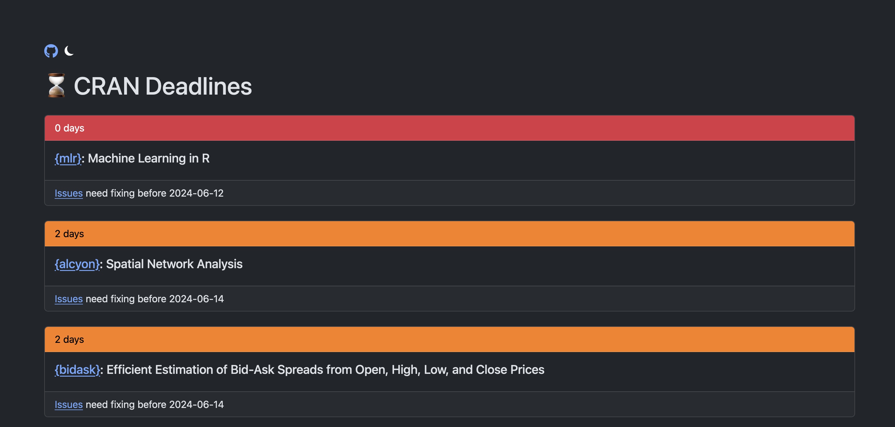

# cran-deadlines

<!-- badges: start -->

<!-- badges: end -->

A simple Shiny app that highlights R packages on [CRAN](https://cran.r-project.org/) that are currently nearing their archival deadlines, according to `tools::CRAN_package_db()`. 

The app is available as a Shinylive app, which means it will run in your browser without the need for a server: [matt-dray.github.io/cran-deadlines/](https://matt-dray.github.io/cran-deadlines/)

Built primarily with [Shiny](https://shiny.posit.co/r/getstarted/shiny-basics/lesson1/index.html) and [{bslib}](https://rstudio.github.io/bslib/), with many thanks to the CRAN team, all package maintainers and [Eric Nantz](https://github.com/rpodcast), who [fixed my Shinylive problems](https://github.com/matt-dray/cran-deadlines/pull/3).

The Shiny app code is in `app/` and the Shinylive version is in `docs/`.

